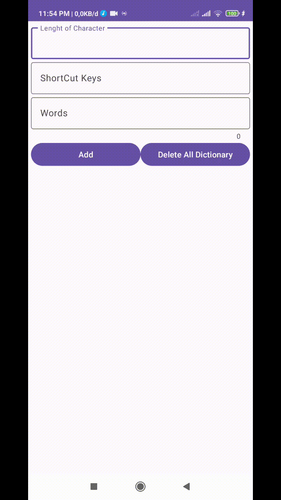
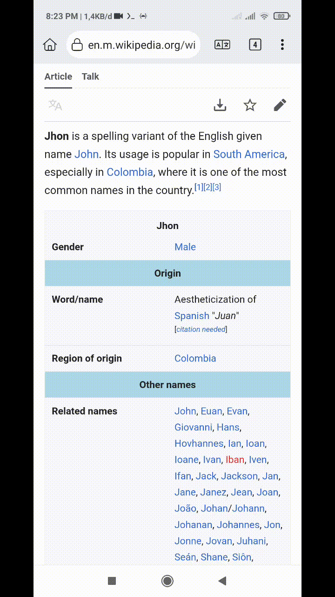

# QZ UserDict

> Aplikasi yang berada di platform android yang berfungsi menambahkan, meyimpan dan memunculkan kostumisasi kata kedalam saran pengetikan keyboard sebagai panggilan cepat dari kata yang telah ditulis.

## Fitur

- Menambah Kamus untuk Papan Ketik
- Panjang kata yang dapat disesuaikan
- Mendukung Text Selection Action

## Instalasi

Anda bisa mendapatkan aplikasinya didalam Release

## App Demo
Preview App

Text Selection Action

## Lisensi Aplikasi

MIT License

Copyright (c) 2024 Qiuby Zhukhi

Permission is hereby granted, free of charge, to any person obtaining a copy
of this software and associated documentation files (the "Software"), to deal
in the Software without restriction, including without limitation the rights
to use, copy, modify, merge, publish, distribute, sublicense, and/or sell
copies of the Software, and to permit persons to whom the Software is
furnished to do so, subject to the following conditions:

The above copyright notice and this permission notice shall be included in all
copies or substantial portions of the Software.

THE SOFTWARE IS PROVIDED "AS IS", WITHOUT WARRANTY OF ANY KIND, EXPRESS OR
IMPLIED, INCLUDING BUT NOT LIMITED TO THE WARRANTIES OF MERCHANTABILITY,
FITNESS FOR A PARTICULAR PURPOSE AND NONINFRINGEMENT. IN NO EVENT SHALL THE
AUTHORS OR COPYRIGHT HOLDERS BE LIABLE FOR ANY CLAIM, DAMAGES OR OTHER
LIABILITY, WHETHER IN AN ACTION OF CONTRACT, TORT OR OTHERWISE, ARISING FROM,
OUT OF OR IN CONNECTION WITH THE SOFTWARE OR THE USE OR OTHER DEALINGS IN THE
SOFTWARE.